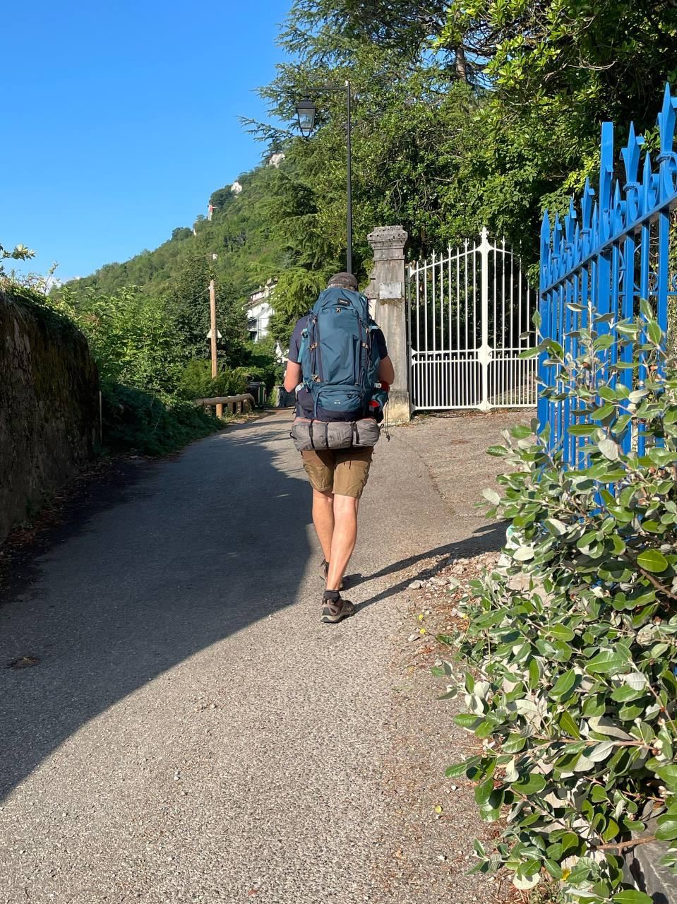

📅 **Date** : 5 juillet 2022  
📍 **Distance** : 24,5 km  
⬆️ **Dénivelé** : +40 m / -40 m (plat)

---

### C’est parti !

Cette première étape était en terrain connu : sortie de Grenoble par les quais des pizzas, puis marche le long de l’Isère en suivant la piste cyclable, puis sur la digue.

Le parcours est assez monotone, en permanence à proximité des voitures, car l’espace est réduit entre le Vercors et la Chartreuse, et je suis constamment près de l'autoroute.

L’Isère est proche mais inaccessible, à quelques mètres en contrebas de la digue, qui est tout le temps couverte de ronces et de buissons.

De toute façon, l’eau marron ne donne pas envie de s’y baigner.

Pour cette première nuit, j’ai planté ma tente au bord du chemin sur la digue : à gauche l’Isère, à droite un golf que je connais pour y avoir fait un déjeuner d’affaires il y a quelques années.

---

